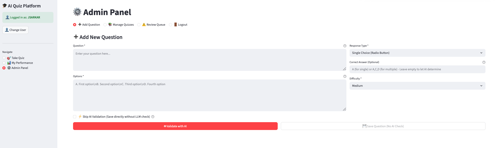
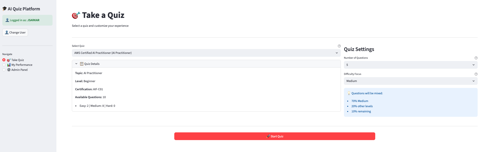
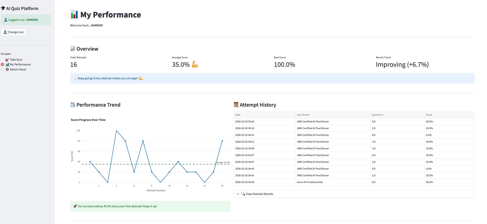

# AI Quiz Platform

A Streamlit-based quiz platform with admin tooling for question/quiz management, AI-assisted validation (Claude + GPT via AWS Bedrock), and end‑user quiz attempts with analytics.

---

## Highlights

- **Admin panel** for creating questions, managing quizzes, and reviewing flagged items
- **AI validation** (Claude + GPT) with disagreement handling and manual review workflow
- **User quiz experience** with skip/return flow and detailed explanations
- **Analytics** with trend chart and attempt history

---

## Architecture (High‑Level)

```
+--------------------+        +--------------------------+
|    Streamlit UI    |        |        AWS Bedrock       |
|  - Admin Panel     |  --->  |  Claude 3 + GPT models   |
|  - Take Quiz       |        +--------------------------+
|  - Analytics       |                    ^
+---------+----------+                    |
          |                               |
          v                               |
+--------------------+        +--------------------------+
|   Services Layer   |  <---  |   LLM Service Adapter    |
|  quiz_service      |        |  (bedrock client)        |
|  question_service  |        +--------------------------+
|  user_service      |
+---------+----------+
          |
          v
+-------------------------------+
|         PostgreSQL            |
|  users / quizzes / questions  |
|  quiz_questions / attempts    |
|  question_attempts            |
+-------------------------------+
```

---

## Project Structure

```
AIQuizApp/
├─ app.py
├─ components/
│  ├─ admin/
│  └─ user/
├─ services/
├─ utils/
├─ database/
├─ config/
├─ Dockerfile
├─ docker-compose.yml
└─ requirements.txt
```

---

## Core Flows

### Admin Question Lifecycle
1. Create question (single/multiple choice)
2. Validate via AI (Claude + GPT)
3. If AI agrees → save directly
4. If AI disagrees → choose answer or flag for review
5. Review Queue allows manual correction and unflagging

### User Quiz Flow
1. User selects quiz + settings
2. Quiz attempt is created
3. User can **Skip**, **Submit & Next**, and return to skipped questions
4. Feedback shows correct answer and explanations
5. Summary page shows performance + detailed review

---

## Data Model (Key Tables)

- `users`
- `quizzes`
- `questions`
- `quiz_questions` (many‑to‑many)
- `quiz_attempts`
- `question_attempts`

See `database/schema.sql` for full definitions and indexes.

---

## Running with Docker

```bash
docker compose up --build -d
```

App: `http://localhost:8510`

> Postgres is exposed on host port **5435**.

---

## Running Locally (No Docker)

1. Create virtual environment
2. Install dependencies
3. Export environment variables
4. Run Streamlit

```bash
python -m venv .venv
source .venv/bin/activate
pip install -r requirements.txt

export DATABASE_URL="postgresql://..."
export AWS_ACCESS_KEY_ID="..."
export AWS_SECRET_ACCESS_KEY="..."
export BEDROCK_LLM_ID_CLAUDE="..."
export BEDROCK_LLM_ID_GPT="..."

streamlit run app.py
```

---

## Environment Variables

Required:
- `DATABASE_URL`
- `AWS_ACCESS_KEY_ID`
- `AWS_SECRET_ACCESS_KEY`
- `BEDROCK_LLM_ID_CLAUDE`
- `BEDROCK_LLM_ID_GPT`

Optional:
- `APP_NAME`
- `APP_PORT`
- `DEBUG_MODE`
- `LLM_TIMEOUT`
- `LLM_MAX_TOKENS`
- `LLM_TEMPERATURE`

---

## Admin Access

Default credentials (configurable via env vars):
- Username: `admin`
- Password: `admin123`

---

## Notes

- Flagged questions are excluded from quizzes until manually reviewed.
- AI explanations are stored and reused (no LLM calls during quiz taking).

---

## License

Private/internal project.

## Screenshots

### Admin Panel


### Take a Quiz


### My Performance


